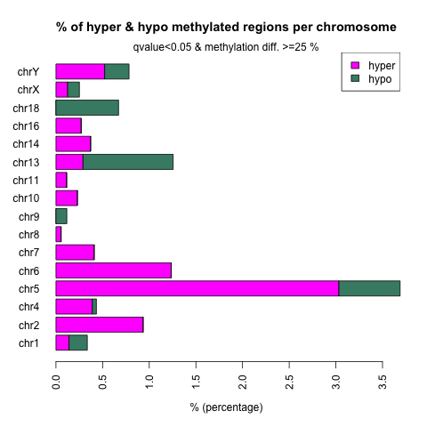

# Differential Methylation Anlysis 

## Method
- Bismark coverage tables are converted as methylKit input
- Strand-specific counts were merged - OriginTop(OT) and OriginBot(OB) strand frequency and counts [dir](figures)
- Fit with Logistic regression and tested oddratio of proportions of methylation between two groups ( methylKit::calculateDiffMeth)   

## Similarity in pairwise-comparisons
- The methylKit does not provide multi-compairons.
- We can infer the relations from the pairwise-comparisons.

| | E18pt5 vs Week4 | Week4 vs 2-year | E18pt5 vs 2-year |
|-|-|-|-|
| correlation | [E18pt5_vs_Week4_cor.png](results/E18pt5_vs_Week4_cor.png) | [Week4_vs_2-year_cor.png](results/Week4_vs_2-year_cor.png) | [E18pt5_vs_2-year_cor.png](results/E18pt5_vs_2-year_cor.png) |
| cluster | [E18pt5_vs_Week4_cluster.png](results/E18pt5_vs_Week4_cluster.png) | [Week4_vs_2-year_cluster.png](results/Week4_vs_2-year_cluster.png) | [E18pt5_vs_2-year_cluster.png](results/E18pt5_vs_2-year_cluster.png) |
| hyper meth of y/x (x_vs_y) | [E18pt5_vs_Week4_diff_25p_05q_hyper.tsv](results/E18pt5_vs_Week4_diff_25p_05q_hyper.tsv) | [Week4_vs_2-year_diff_25p_05q_hyper.tsv](results/Week4_vs_2-year_diff_25p_05q_hyper.tsv) | [E18pt5_vs_2-year_diff_25p_05q_hyper.tsv](results/E18pt5_vs_2-year_diff_25p_05q_hyper.tsv) |
| hypo meth of y/x (x_vs_y) | [E18pt5_vs_Week4_diff_25p_05q_hypo.tsv](results/E18pt5_vs_Week4_diff_25p_05q_hypo.tsv) | [Week4_vs_2-year_diff_25p_05q_hypo.tsv](results/Week4_vs_2-year_diff_25p_05q_hypo.tsv) | [E18pt5_vs_2-year_diff_25p_05q_hypo.tsv](results/E18pt5_vs_2-year_diff_25p_05q_hypo.tsv) |
| chrom pattern |  |  | [E18pt5_vs_2-year_diff_25p_05q_per_chrom.png](results/E18pt5_vs_2-year_diff_25p_05q_per_chrom.png) |
| genomic feat. | [E18pt5_vs_Week4_diff_25p_05q_per_genomefeature.png](results/E18pt5_vs_Week4_diff_25p_05q_per_genomefeature.png) | [Week4_vs_2-year_diff_25p_05q_per_genomefeature.png](results/Week4_vs_2-year_diff_25p_05q_per_genomefeature.png) | [E18pt5_vs_2-year_diff_25p_05q_per_genomefeature.png](results/E18pt5_vs_2-year_diff_25p_05q_per_genomefeature.png) |

## Summary Heatmap

[merged_diff.tsv](results/merged_diff.tsv)

E18pt5_vs_2-year_diff.tsv
E18pt5_vs_2-year_diff_25p_05q_hyper.tsv
E18pt5_vs_2-year_diff_25p_05q_hypo.tsv
E18pt5_vs_2-year_diff_25p_05q_per_chrom.png
E18pt5_vs_2-year_diff_25p_05q_per_genomefeature.png
E18pt5_vs_Week4_cluster.png
E18pt5_vs_Week4_cor.png
E18pt5_vs_Week4_diff.tsv
E18pt5_vs_Week4_diff_25p_05q_hyper.tsv
E18pt5_vs_Week4_diff_25p_05q_hypo.tsv
E18pt5_vs_Week4_diff_25p_05q_per_chrom.png
E18pt5_vs_Week4_diff_25p_05q_per_genomefeature.png
Week4_vs_2-year_cluster.png
Week4_vs_2-year_cor.png
Week4_vs_2-year_diff.tsv
Week4_vs_2-year_diff_25p_05q_hyper.tsv
Week4_vs_2-year_diff_25p_05q_hypo.tsv
Week4_vs_2-year_diff_25p_05q_per_chrom.png
Week4_vs_2-year_diff_25p_05q_per_genomefeature.png
bw
merged_diff.heatmap.pdf
merged_diff.tsv
target_1k.bed

