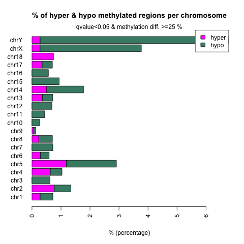
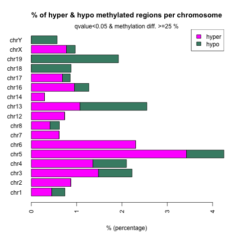
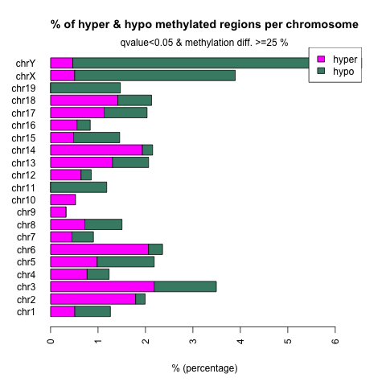

# Differential Methylation Anlysis 
## Updates
- Increased depth by using bam files directly
- Added genomic annotations to the diff data

## Data
- fastq files: pioneer.case.edu:/mnt/vstor/SOM_GENE_BEG33/data/emseq/250220_MY12882_fastq
- emseq results: pioneer.case.edu:/mnt/vstor/SOM_GENE_BEG33/data/emseq/bigdata/emseq
- bedGraph files: pioneer.case.edu:/mnt/vstor/SOM_GENE_BEG33/data/emseq/bedGraph (need to be merged by sample)

## Method
- Alignment was performed using Bismark.
- (Pair-wise) Differential analysis was conducted using methylKit.
- Bismark coverage tables were converted into methylKit input format.
- Strand-specific counts were merged, combining OriginTop (OT) and OriginBot (OB) strand frequency and counts [link](figures).
- Logistic regression was applied to test the odds ratio of methylation proportions between two groups using methylKit::calculateDiffMeth.

## Results
- methylKit does not support multiple comparisons.
- We can infer relationships from pairwise comparisons.

| | E18pt5 vs Week4 | Week4 vs 2-year | E18pt5 vs 2-year |
|-|-|-|-| 
| Diff Sites |[hyper](post/2025-04-04/E18pt5_vs_Week4_diff_25p_05q_hyper.tsv),[hypo](post/2025-04-04/E18pt5_vs_Week4_diff_25p_05q_hypo.tsv)|[hyper](post/2025-04-04/Week4_vs_2-year_diff_25p_05q_hyper.tsv),[hypo](post/2025-04-04/Week4_vs_2-year_diff_25p_05q_hypo.tsv)|[hyper](post/2025-04-04/E18pt5_vs_2-year_diff_25p_05q_hyper.tsv),[hypo](post/2025-04-04/E18pt5_vs_2-year_diff_25p_05q_hypo.tsv)|
| Chrom Profile||||
| CpG Feature ||||
| Genome Feature ||||
