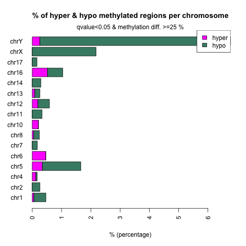
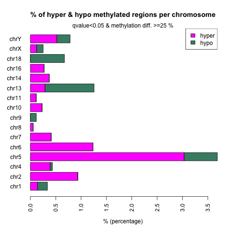
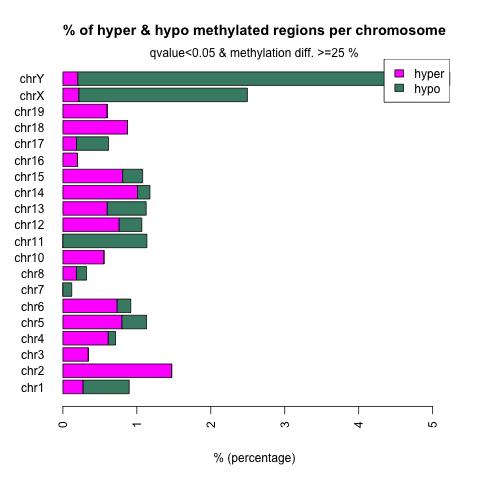
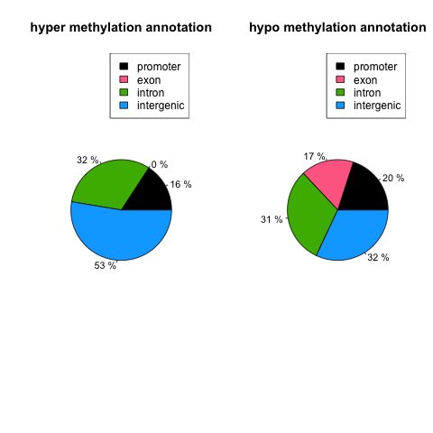
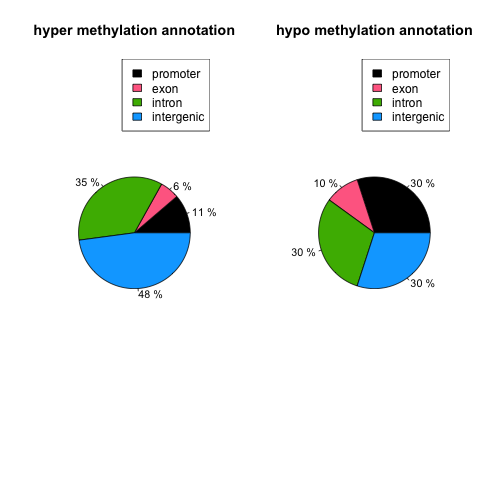
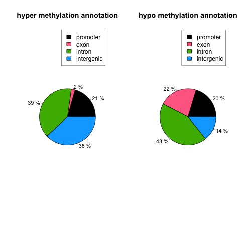

# Differential Methylation Anlysis 
## Data
- fastq files: pioneer.case.edu:/mnt/vstor/SOM_GENE_BEG33/data/emseq/250220_MY12882_fastq
- emseq results: pioneer.case.edu:/mnt/vstor/SOM_GENE_BEG33/data/emseq/bigdata/emseq
- bedGraph files: pioneer.case.edu:/mnt/vstor/SOM_GENE_BEG33/data/emseq/bedGraph (need to be merged by sample)

## Method
- Alignment was performed using Bismark.
- (Pair-wise) Differential analysis was conducted using methylKit.
- Bismark coverage tables were converted into methylKit input format.
- Strand-specific counts were merged, combining OriginTop (OT) and OriginBot (OB) strand frequency and counts [link](figures).
- Logistic regression was applied to test the odds ratio of methylation proportions between two groups using methylKit::calculateDiffMeth.

## Results
- methylKit does not support multiple comparisons.
- We can infer relationships from pairwise comparisons.

| | E18pt5 vs Week4 | Week4 vs 2-year | E18pt5 vs 2-year |
|-|-|-|-|
| correlation | [E18pt5_vs_Week4_cor.png](results/E18pt5_vs_Week4_cor.png) | [Week4_vs_2-year_cor.png](results/Week4_vs_2-year_cor.png) | [E18pt5_vs_2-year_cor.png](results/E18pt5_vs_2-year_cor.png) |
| cluster | [E18pt5_vs_Week4_cluster.png](results/E18pt5_vs_Week4_cluster.png) | [Week4_vs_2-year_cluster.png](results/Week4_vs_2-year_cluster.png) | [E18pt5_vs_2-year_cluster.png](results/E18pt5_vs_2-year_cluster.png) |
| hyper meth of y/x (x_vs_y) | [E18pt5_vs_Week4_diff_25p_05q_hyper_anno.tsv](results/E18pt5_vs_Week4_diff_25p_05q_hyper_anno.tsv) | [Week4_vs_2-year_diff_25p_05q_hyper_anno.tsv](results/Week4_vs_2-year_diff_25p_05q_hyper_anno.tsv) | [E18pt5_vs_2-year_diff_25p_05q_hyper_anno.tsv](results/E18pt5_vs_2-year_diff_25p_05q_hyper_anno.tsv) |
| hypo meth of y/x (x_vs_y) | [E18pt5_vs_Week4_diff_25p_05q_hypo_anno.tsv](results/E18pt5_vs_Week4_diff_25p_05q_hypo_anno.tsv) | [Week4_vs_2-year_diff_25p_05q_hypo_anno.tsv](results/Week4_vs_2-year_diff_25p_05q_hypo_anno.tsv) | [E18pt5_vs_2-year_diff_25p_05q_hypo_anno.tsv](results/E18pt5_vs_2-year_diff_25p_05q_hypo_anno.tsv) |
| chrom pattern |  |  |  |
| genomic feat. |  |  |  |

## Summary
- Hypo-methylation on chrX and chrY after Week 4.
- Chromosomal methylation changed primarily after Week 4.
- Changes at the promoter occurred after Week 4 but remained stable at 2 years.
- Heatmap of Altered methylation:

[merged_diff_anno.tsv](results/merged_diff_anno.tsv)

