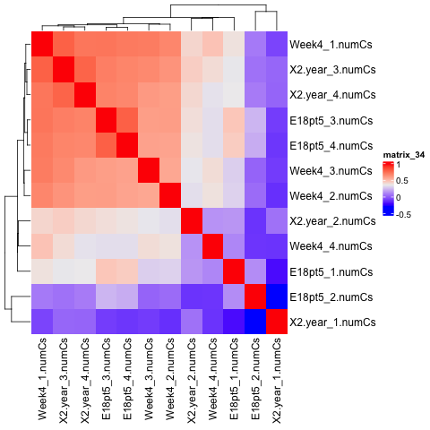
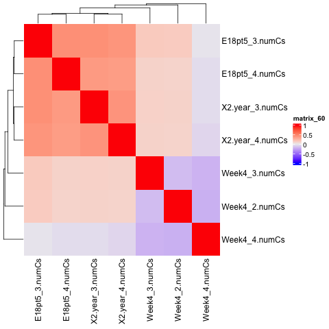
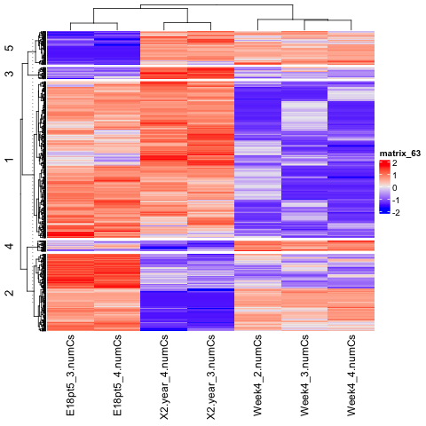

## Filtering Outliers 
- Outliers: E1, E2, W1, Y1, Y2

| before | after |
| :-: | :-: |
|  |  |

## ANOVA and Clustering
- Used percent C methylation from filtered samples
- Applied a p-value threshold of 0.05 based on F-statistics for mean/variance differences (ANOVA)
- Grouped samples into 5 clusters based on methylation patterns

| Heatmap |
| :-: | 
|   |

## Annotation Per cluster

| cluster id | annotation file | GO |
| :-: | :-: | :-: |
| all | [all.annotation](filtered_anova_anno.tsv) | [go](https://github.com/hmgene/emseq/blob/main/results/2025-04-11/filtered_anova_anno_go/geneOntology.html) |
| all | [all.annotation](filtered_anova_cluster1_anno.tsv) | [go](https://github.com/hmgene/emseq/blob/main/results/2025-04-11/filtered_anova_cluster1_anno_go/geneOntology.html) |
| all | [all.annotation](filtered_anova_cluster2_anno.tsv) | [go](https://github.com/hmgene/emseq/blob/main/results/2025-04-11/filtered_anova_cluster2_anno_go/geneOntology.html) |
| all | [all.annotation](filtered_anova_cluster3_anno.tsv) | [go](https://github.com/hmgene/emseq/blob/main/results/2025-04-11/filtered_anova_cluster3_anno_go/geneOntology.html) |
| all | [all.annotation](filtered_anova_cluster4_anno.tsv) | [go](https://github.com/hmgene/emseq/blob/main/results/2025-04-11/filtered_anova_cluster4_anno_go/geneOntology.html) |
| all | [all.annotation](filtered_anova_cluster5_anno.tsv) | [go](https://github.com/hmgene/emseq/blob/main/results/2025-04-11/filtered_anova_cluster5_anno_go/geneOntology.html) |
