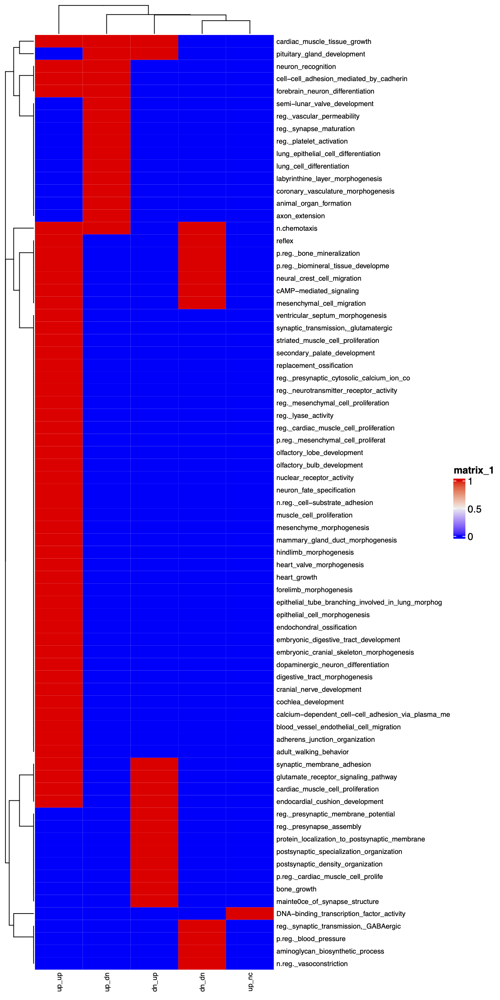

## summary 

86% mapping, 74% methylation rates
 [summary_table](summary.tsv)

## Using a lower depth cutoff (3x) reduced heterogeneity across both 1 bp and 10 bp resolutions  

## Trend Analysis  
Using 3×10 bp resolutions, sites were annotated with overlapping genomic features.  
E–W–Y trends were determined using an ANOVA p-value threshold of 0.05.

### Average Methylation %

| Group         | Sites | Mean E (%) | Mean W (%) | Mean Y (%) |
|---------------|-------|------------|------------|------------|
| 3prim         | 1405  | 63.68      | 62.18      | 57.69      |
| 5prim         | 238   | 54.65      | 55.01      | 48.14      |
| Intergenic    | 57719 | 66.99      | 64.80      | 65.03      |
| TTS           | 1813  | 63.25      | 61.61      | 59.46      |
| Exon          | 3712  | 55.99      | 62.62      | 65.01      |
| Intron        | 50188 | 66.36      | 62.11      | 56.78      |
| Non-coding    | 944   | 48.39      | 52.67      | 54.03      |
| Promoter-TSS  | 3910  | 53.80      | 54.20      | 53.03      |

###  E-W-Y Trends (E-W: up/dn, W-Y : up/dn)

| Group         | dn_dn | dn_nc | dn_up | nc_dn | nc_up | up_dn | up_nc | up_up |
|---------------|-------|-------|-------|-------|-------|-------|-------|-------|
| 3prim         | 373   | 0     | 356   | 2     | 1     | 379   | 4     | 290   |
| 5prim         | 66    | 1     | 52    | 0     | 0     | 68    | 1     | 50    |
| exon          | 659   | 1     | 896   | 2     | 1     | 1027  | 12    | 1114  |
| Intergenic    | 11706 | 40    | 18309 | 99    | 41    | 16211 | 211   | 11102 |
| intron        | 14279 | 49    | 13243 | 95    | 25    | 13484 | 145   | 8868  |
| non-coding    | 156   | 1     | 159   | 2     | 2     | 183   | 2     | 439   |
| promoter-TSS  | 863   | 3     | 1072  | 2     | 2     | 1140  | 13    | 815   |
| TTS           | 458   | 1     | 464   | 2     | 2     | 473   | 6     | 407   |

 [anova_annotation_trend.table]( filtered.3x.10bp.anova.anno.trend.tsv.gz )

### Violin Plots 

### GO-Bioprocess Terms

| Trend    | Theme                                               | Stage                 | Key Systems                         |
|----------|-----------------------------------------------------|-----------------------|-------------------------------------|
| Up–Up    | early morphogenetic programs                        | Early → Late silencing | Neural crest, mesenchyme, skeletal  |
| Up–Down  | Temporary activation followed by repression         | Mid → Late            | Lung, brain, vasculature, synapse   |
| Down–Up  | Later activation for functional maturation          | Late                  | Synaptic, cardiac, skeletal         |

