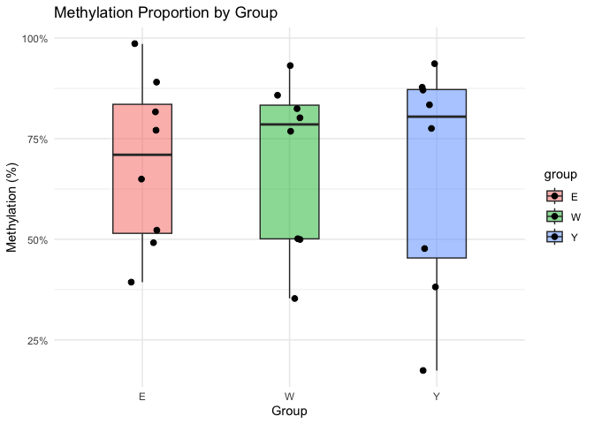

<table>
<caption>CpG and uCpG Counts with Methylation Proportions</caption>
<thead>
<tr class="header">
<th style="text-align: left;">id</th>
<th style="text-align: right;">CpG</th>
<th style="text-align: right;">uCpG</th>
<th style="text-align: left;">group</th>
<th style="text-align: right;">total</th>
<th style="text-align: right;">prop</th>
</tr>
</thead>
<tbody>
<tr class="odd">
<td style="text-align: left;">Y1</td>
<td style="text-align: right;">4308615</td>
<td style="text-align: right;">642693</td>
<td style="text-align: left;">Y</td>
<td style="text-align: right;">4951308</td>
<td style="text-align: right;">0.8701973</td>
</tr>
<tr class="even">
<td style="text-align: left;">Y2</td>
<td style="text-align: right;">25330027</td>
<td style="text-align: right;">3053642</td>
<td style="text-align: left;">Y</td>
<td style="text-align: right;">28383669</td>
<td style="text-align: right;">0.8924155</td>
</tr>
<tr class="odd">
<td style="text-align: left;">Y3</td>
<td style="text-align: right;">42007137</td>
<td style="text-align: right;">5055681</td>
<td style="text-align: left;">Y</td>
<td style="text-align: right;">47062818</td>
<td style="text-align: right;">0.8925759</td>
</tr>
<tr class="even">
<td style="text-align: left;">Y4</td>
<td style="text-align: right;">40587466</td>
<td style="text-align: right;">4944743</td>
<td style="text-align: left;">Y</td>
<td style="text-align: right;">45532209</td>
<td style="text-align: right;">0.8914012</td>
</tr>
<tr class="odd">
<td style="text-align: left;">E1</td>
<td style="text-align: right;">21675688</td>
<td style="text-align: right;">2860849</td>
<td style="text-align: left;">E</td>
<td style="text-align: right;">24536537</td>
<td style="text-align: right;">0.8834045</td>
</tr>
<tr class="even">
<td style="text-align: left;">E2</td>
<td style="text-align: right;">10002396</td>
<td style="text-align: right;">1461799</td>
<td style="text-align: left;">E</td>
<td style="text-align: right;">11464195</td>
<td style="text-align: right;">0.8724900</td>
</tr>
<tr class="odd">
<td style="text-align: left;">E3</td>
<td style="text-align: right;">43584903</td>
<td style="text-align: right;">5651380</td>
<td style="text-align: left;">E</td>
<td style="text-align: right;">49236283</td>
<td style="text-align: right;">0.8852192</td>
</tr>
<tr class="even">
<td style="text-align: left;">E4</td>
<td style="text-align: right;">41349553</td>
<td style="text-align: right;">5410179</td>
<td style="text-align: left;">E</td>
<td style="text-align: right;">46759732</td>
<td style="text-align: right;">0.8842983</td>
</tr>
<tr class="odd">
<td style="text-align: left;">W1</td>
<td style="text-align: right;">38800768</td>
<td style="text-align: right;">4861527</td>
<td style="text-align: left;">W</td>
<td style="text-align: right;">43662295</td>
<td style="text-align: right;">0.8886562</td>
</tr>
<tr class="even">
<td style="text-align: left;">W2</td>
<td style="text-align: right;">22889880</td>
<td style="text-align: right;">2956346</td>
<td style="text-align: left;">W</td>
<td style="text-align: right;">25846226</td>
<td style="text-align: right;">0.8856179</td>
</tr>
<tr class="odd">
<td style="text-align: left;">W3</td>
<td style="text-align: right;">22925819</td>
<td style="text-align: right;">2974891</td>
<td style="text-align: left;">W</td>
<td style="text-align: right;">25900710</td>
<td style="text-align: right;">0.8851425</td>
</tr>
<tr class="even">
<td style="text-align: left;">W4</td>
<td style="text-align: right;">17946855</td>
<td style="text-align: right;">2253938</td>
<td style="text-align: left;">W</td>
<td style="text-align: right;">20200793</td>
<td style="text-align: right;">0.8884233</td>
</tr>
</tbody>
</table>

CpG and uCpG Counts with Methylation Proportions

    ## 
    ## Call:
    ## glm(formula = cbind(CpG, uCpG) ~ group, family = binomial, data = df)
    ## 
    ## Coefficients:
    ##              Estimate Std. Error z value Pr(>|z|)    
    ## (Intercept) 2.0255154  0.0002713 7467.31   <2e-16 ***
    ## groupW      0.0364297  0.0004000   91.08   <2e-16 ***
    ## groupY      0.0779047  0.0003943  197.56   <2e-16 ***
    ## ---
    ## Signif. codes:  0 '***' 0.001 '**' 0.01 '*' 0.05 '.' 0.1 ' ' 1
    ## 
    ## (Dispersion parameter for binomial family taken to be 1)
    ## 
    ##     Null deviance: 79637  on 11  degrees of freedom
    ## Residual deviance: 40559  on  9  degrees of freedom
    ## AIC: 40764
    ## 
    ## Number of Fisher Scoring iterations: 3

    ## Null deviance: 79637 on 11 degrees of freedom

    ## Residual deviance: 40559 on 9 degrees of freedom

    ## AIC: 40764

<table>
<caption>Estimated Methylation Proportions by Group (from GLM)</caption>
<thead>
<tr class="header">
<th style="text-align: left;">Group</th>
<th style="text-align: right;">Estimated_Proportion</th>
</tr>
</thead>
<tbody>
<tr class="odd">
<td style="text-align: left;">E</td>
<td style="text-align: right;">0.8835</td>
</tr>
<tr class="even">
<td style="text-align: left;">W</td>
<td style="text-align: right;">0.8871</td>
</tr>
<tr class="odd">
<td style="text-align: left;">Y</td>
<td style="text-align: right;">0.8912</td>
</tr>
</tbody>
</table>

Estimated Methylation Proportions by Group (from GLM)
