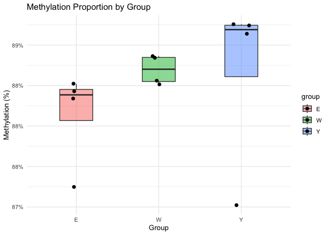

    knitr::opts_chunk$set(echo = TRUE, warning = FALSE, message = FALSE)
    library(ggplot2)

    ## Warning: package 'ggplot2' was built under R version 4.4.3

    library(dplyr)

    ## 
    ## Attaching package: 'dplyr'

    ## The following objects are masked from 'package:stats':
    ## 
    ##     filter, lag

    ## The following objects are masked from 'package:base':
    ## 
    ##     intersect, setdiff, setequal, union

    library(data.table)

    ## Warning: package 'data.table' was built under R version 4.4.3

    ## 
    ## Attaching package: 'data.table'

    ## The following objects are masked from 'package:dplyr':
    ## 
    ##     between, first, last

    # Simulated example dataset
    #df <- data.frame(
    #  Sample = paste0("S", 1:6),
    #  group = c("E", "E", "W", "W", "Y", "Y"),
    #  CpG = c(1200, 1350, 1100, 1080, 1150, 1170),
    #  uCpG = c(300, 250, 400, 420, 380, 360)
    #)
    df = fread("cpg_prop_by_group.csv")
    df <- df %>% mutate( total = CpG + uCpG, prop = CpG / total)

    knitr::kable(df, caption = "CpG and uCpG Counts with Methylation Proportions")

<table>
<caption>CpG and uCpG Counts with Methylation Proportions</caption>
<thead>
<tr class="header">
<th style="text-align: right;">CpG</th>
<th style="text-align: right;">uCpG</th>
<th style="text-align: left;">group</th>
<th style="text-align: right;">total</th>
<th style="text-align: right;">prop</th>
</tr>
</thead>
<tbody>
<tr class="odd">
<td style="text-align: right;">4308615</td>
<td style="text-align: right;">642693</td>
<td style="text-align: left;">Y</td>
<td style="text-align: right;">4951308</td>
<td style="text-align: right;">0.8701973</td>
</tr>
<tr class="even">
<td style="text-align: right;">642693</td>
<td style="text-align: right;">3053642</td>
<td style="text-align: left;">Y</td>
<td style="text-align: right;">3696335</td>
<td style="text-align: right;">0.1738730</td>
</tr>
<tr class="odd">
<td style="text-align: right;">25330027</td>
<td style="text-align: right;">5055681</td>
<td style="text-align: left;">Y</td>
<td style="text-align: right;">30385708</td>
<td style="text-align: right;">0.8336165</td>
</tr>
<tr class="even">
<td style="text-align: right;">3053642</td>
<td style="text-align: right;">4944743</td>
<td style="text-align: left;">Y</td>
<td style="text-align: right;">7998385</td>
<td style="text-align: right;">0.3817823</td>
</tr>
<tr class="odd">
<td style="text-align: right;">42007137</td>
<td style="text-align: right;">2860849</td>
<td style="text-align: left;">Y</td>
<td style="text-align: right;">44867986</td>
<td style="text-align: right;">0.9362385</td>
</tr>
<tr class="even">
<td style="text-align: right;">5055681</td>
<td style="text-align: right;">1461799</td>
<td style="text-align: left;">Y</td>
<td style="text-align: right;">6517480</td>
<td style="text-align: right;">0.7757110</td>
</tr>
<tr class="odd">
<td style="text-align: right;">40587466</td>
<td style="text-align: right;">5651380</td>
<td style="text-align: left;">Y</td>
<td style="text-align: right;">46238846</td>
<td style="text-align: right;">0.8777785</td>
</tr>
<tr class="even">
<td style="text-align: right;">4944743</td>
<td style="text-align: right;">5410179</td>
<td style="text-align: left;">Y</td>
<td style="text-align: right;">10354922</td>
<td style="text-align: right;">0.4775259</td>
</tr>
<tr class="odd">
<td style="text-align: right;">21675688</td>
<td style="text-align: right;">4861527</td>
<td style="text-align: left;">E</td>
<td style="text-align: right;">26537215</td>
<td style="text-align: right;">0.8168034</td>
</tr>
<tr class="even">
<td style="text-align: right;">2860849</td>
<td style="text-align: right;">2956346</td>
<td style="text-align: left;">E</td>
<td style="text-align: right;">5817195</td>
<td style="text-align: right;">0.4917918</td>
</tr>
<tr class="odd">
<td style="text-align: right;">10002396</td>
<td style="text-align: right;">2974891</td>
<td style="text-align: left;">E</td>
<td style="text-align: right;">12977287</td>
<td style="text-align: right;">0.7707617</td>
</tr>
<tr class="even">
<td style="text-align: right;">1461799</td>
<td style="text-align: right;">2253938</td>
<td style="text-align: left;">E</td>
<td style="text-align: right;">3715737</td>
<td style="text-align: right;">0.3934076</td>
</tr>
<tr class="odd">
<td style="text-align: right;">43584903</td>
<td style="text-align: right;">642693</td>
<td style="text-align: left;">E</td>
<td style="text-align: right;">44227596</td>
<td style="text-align: right;">0.9854685</td>
</tr>
<tr class="even">
<td style="text-align: right;">5651380</td>
<td style="text-align: right;">3053642</td>
<td style="text-align: left;">E</td>
<td style="text-align: right;">8705022</td>
<td style="text-align: right;">0.6492092</td>
</tr>
<tr class="odd">
<td style="text-align: right;">41349553</td>
<td style="text-align: right;">5055681</td>
<td style="text-align: left;">E</td>
<td style="text-align: right;">46405234</td>
<td style="text-align: right;">0.8910536</td>
</tr>
<tr class="even">
<td style="text-align: right;">5410179</td>
<td style="text-align: right;">4944743</td>
<td style="text-align: left;">E</td>
<td style="text-align: right;">10354922</td>
<td style="text-align: right;">0.5224741</td>
</tr>
<tr class="odd">
<td style="text-align: right;">38800768</td>
<td style="text-align: right;">2860849</td>
<td style="text-align: left;">W</td>
<td style="text-align: right;">41661617</td>
<td style="text-align: right;">0.9313313</td>
</tr>
<tr class="even">
<td style="text-align: right;">4861527</td>
<td style="text-align: right;">1461799</td>
<td style="text-align: left;">W</td>
<td style="text-align: right;">6323326</td>
<td style="text-align: right;">0.7688243</td>
</tr>
<tr class="odd">
<td style="text-align: right;">22889880</td>
<td style="text-align: right;">5651380</td>
<td style="text-align: left;">W</td>
<td style="text-align: right;">28541260</td>
<td style="text-align: right;">0.8019926</td>
</tr>
<tr class="even">
<td style="text-align: right;">2956346</td>
<td style="text-align: right;">5410179</td>
<td style="text-align: left;">W</td>
<td style="text-align: right;">8366525</td>
<td style="text-align: right;">0.3533541</td>
</tr>
<tr class="odd">
<td style="text-align: right;">22925819</td>
<td style="text-align: right;">4861527</td>
<td style="text-align: left;">W</td>
<td style="text-align: right;">27787346</td>
<td style="text-align: right;">0.8250453</td>
</tr>
<tr class="even">
<td style="text-align: right;">2974891</td>
<td style="text-align: right;">2956346</td>
<td style="text-align: left;">W</td>
<td style="text-align: right;">5931237</td>
<td style="text-align: right;">0.5015633</td>
</tr>
<tr class="odd">
<td style="text-align: right;">17946855</td>
<td style="text-align: right;">2974891</td>
<td style="text-align: left;">W</td>
<td style="text-align: right;">20921746</td>
<td style="text-align: right;">0.8578087</td>
</tr>
<tr class="even">
<td style="text-align: right;">2253938</td>
<td style="text-align: right;">2253938</td>
<td style="text-align: left;">W</td>
<td style="text-align: right;">4507876</td>
<td style="text-align: right;">0.5000000</td>
</tr>
</tbody>
</table>

CpG and uCpG Counts with Methylation Proportions

    ggplot(df, aes(x = group, y = prop, fill = group)) +
      geom_boxplot(width = 0.4, alpha = 0.5, outlier.shape = NA) +
      geom_jitter(width = 0.1, size = 2) +
      scale_y_continuous(labels = scales::percent_format(accuracy = 1)) +
      labs(title = "Methylation Proportion by Group",
           y = "Methylation (%)", x = "Group") +
      theme_minimal()

    glm_fit <- glm(cbind(CpG, uCpG) ~ group, data = df, family = binomial)
    summary(glm_fit)

    ## 
    ## Call:
    ## glm(formula = cbind(CpG, uCpG) ~ group, family = binomial, data = df)
    ## 
    ## Coefficients:
    ##               Estimate Std. Error z value Pr(>|z|)    
    ## (Intercept)  1.5964873  0.0002121  7528.6   <2e-16 ***
    ## groupW      -0.1937415  0.0002980  -650.2   <2e-16 ***
    ## groupY      -0.1308449  0.0002955  -442.9   <2e-16 ***
    ## ---
    ## Signif. codes:  0 '***' 0.001 '**' 0.01 '*' 0.05 '.' 0.1 ' ' 1
    ## 
    ## (Dispersion parameter for binomial family taken to be 1)
    ## 
    ##     Null deviance: 74160572  on 23  degrees of freedom
    ## Residual deviance: 73717859  on 21  degrees of freedom
    ## AIC: 73718256
    ## 
    ## Number of Fisher Scoring iterations: 5

    cat("Null deviance:", round(glm_fit$null.deviance), "on", glm_fit$df.null, "degrees of freedom\n")

    ## Null deviance: 74160572 on 23 degrees of freedom

    cat("Residual deviance:", round(glm_fit$deviance), "on", glm_fit$df.residual, "degrees of freedom\n")

    ## Residual deviance: 73717859 on 21 degrees of freedom

    cat("AIC:", round(AIC(glm_fit)), "\n")

    ## AIC: 73718256

    invlogit <- function(x) exp(x) / (1 + exp(x))

    p_E <- invlogit(coef(glm_fit)["(Intercept)"])
    p_W <- invlogit(coef(glm_fit)["(Intercept)"] + coef(glm_fit)["groupW"])
    p_Y <- invlogit(coef(glm_fit)["(Intercept)"] + coef(glm_fit)["groupY"])

    rate_df <- data.frame(
      Group = c("E", "W", "Y"),
      Estimated_Proportion = round(c(p_E, p_W, p_Y), 4)
    )

    knitr::kable(rate_df, caption = "Estimated Methylation Proportions by Group (from GLM)")

<table>
<caption>Estimated Methylation Proportions by Group (from GLM)</caption>
<thead>
<tr class="header">
<th style="text-align: left;">Group</th>
<th style="text-align: right;">Estimated_Proportion</th>
</tr>
</thead>
<tbody>
<tr class="odd">
<td style="text-align: left;">E</td>
<td style="text-align: right;">0.8315</td>
</tr>
<tr class="even">
<td style="text-align: left;">W</td>
<td style="text-align: right;">0.8026</td>
</tr>
<tr class="odd">
<td style="text-align: left;">Y</td>
<td style="text-align: right;">0.8124</td>
</tr>
</tbody>
</table>

Estimated Methylation Proportions by Group (from GLM)
