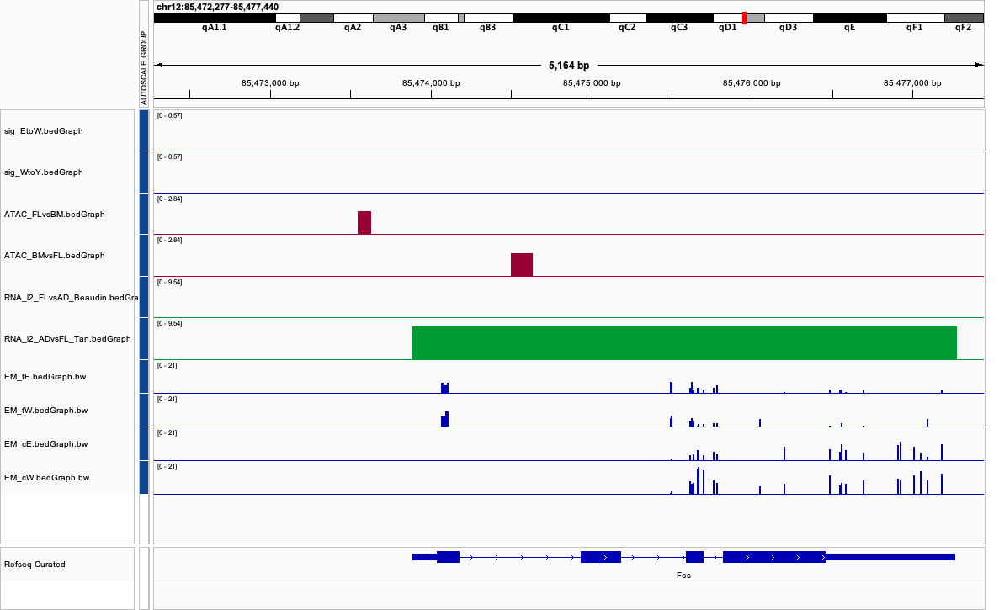
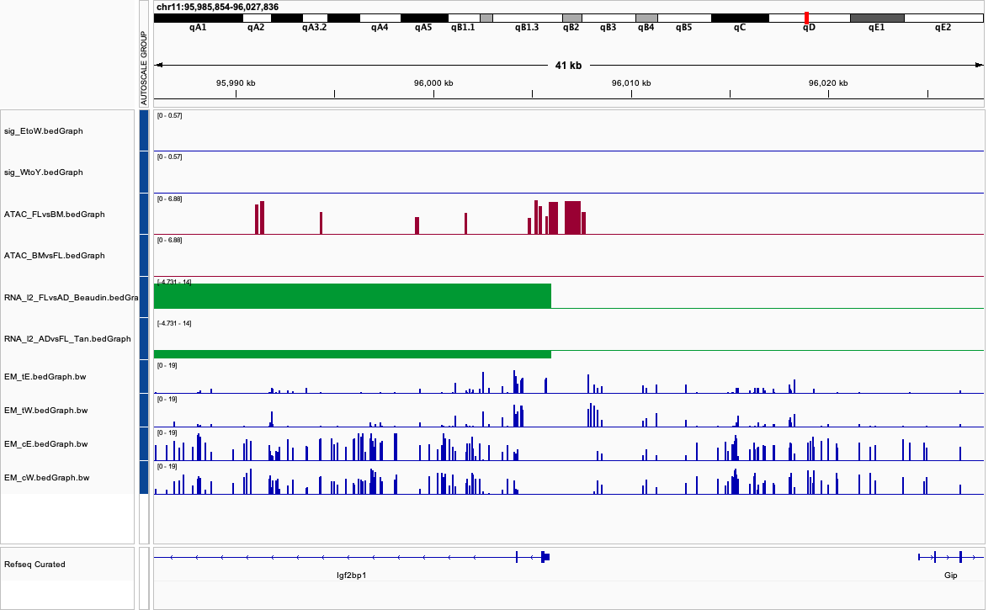

### Data
- 'Beaudin' PMID 27666010 - DEGs comparing FL versus adult HSCs - positive FC values are enriched in FL, negative values in BM.
- 'Tan' PMID 31851943 - DEGs comparing adult versus FL HSCs - positive FC values are enriched in ADULT, negative in FL (the other way around).
- The ATAC-seq datasets are from PMID 35584393 - these are pseudobulk of the scATAC-seq from this paper. They are MACS readout files - one with peaks enriched in FL vs adult HSCs, the other adult vs FL HSCs. As a sanity check, there are more accessible regions in FL compared to adult HSCs as we would expect.


### Before Outlier Filtering
```{r setup, echo=FALSE, warning=FALSE, message=FALSE}
knitr::opts_chunk$set(echo = FALSE, warning = FALSE, message = FALSE)

library(ggplot2)
library(dplyr)
library(data.table)

df=fread("cpg_prop_by_group.csv")
df[,prop := CpG/(CpG+uCpG)]

knitr::kable(df, caption = "CpG and uCpG Counts with Methylation Proportions")
ggplot(df, aes(x = group, y = prop, fill = group)) +
  geom_boxplot(width = 0.4, alpha = 0.5, outlier.shape = NA) +
  geom_jitter(width = 0.1, size = 2) +
  scale_y_continuous(labels = scales::percent_format(accuracy = 1)) +
  labs(title = "Methylation Proportion by Group",
       y = "Methylation (%)", x = "Group") +
  theme_minimal()
```

### After Outlier Filtering 

```{r outlier}
df = df[!id %in% c("Y1","E2")]
ggplot(df, aes(x = group, y = prop, fill = group)) +
  geom_boxplot(width = 0.4, alpha = 0.5, outlier.shape = NA) +
  geom_jitter(width = 0.1, size = 2) +
  scale_y_continuous(labels = scales::percent_format(accuracy = 1)) +
  labs(title = "Methylation Proportion by Group", y = "Methylation (%)", x = "Group") +
  theme_minimal()
glm_fit <- glm(cbind(CpG, uCpG) ~ group, data = df, family = binomial)
summary(glm_fit)

cat("Null deviance:", round(glm_fit$null.deviance), "on", glm_fit$df.null, "degrees of freedom\n")
cat("Residual deviance:", round(glm_fit$deviance), "on", glm_fit$df.residual, "degrees of freedom\n")
cat("AIC:", round(AIC(glm_fit)), "\n")

invlogit <- function(x) exp(x) / (1 + exp(x))
p_E <- invlogit(coef(glm_fit)["(Intercept)"])
p_W <- invlogit(coef(glm_fit)["(Intercept)"] + coef(glm_fit)["groupW"])
p_Y <- invlogit(coef(glm_fit)["(Intercept)"] + coef(glm_fit)["groupY"])

rate_df <- data.frame(
  Group = c("E", "W", "Y"),
  Estimated_Proportion = round(c(p_E, p_W, p_Y), 4)
)

knitr::kable(rate_df, caption = "Estimated Methylation Proportions by Group (from GLM)")
```

### Differential Sites
```{r diff-sites, message=FALSE, warning=FALSE}
    source("fn.r")
    pthr=0.05
    input="../../bigdata/2025-08-01/filtered_3rep_3x_per_group.csv.gz"
    input_sig="sig.csv";
    em=fread(input)

    em[, grep("Y1|E2", names(em),value=T) := NULL ]
    for (g in c("E", "W", "Y")) {
      em[, paste0("t", g) := rowSums(.SD, na.rm = TRUE), .SDcols = grep(paste0(g, "\\d+\\.uCpG"), names(em), value = TRUE)]
      em[, paste0("c", g) := rowSums(.SD, na.rm = TRUE), .SDcols = grep(paste0(g, "\\d+\\.CpG"), names(em), value = TRUE)]
      em[, paste0("p", g) := get(paste0("c", g)) / (get(paste0("t", g))+get(paste0("c",g)))]
    }
    em[,`:=`(start = as.integer(start), end = as.integer(start + 1))]
    em=em[,.(chrom,start,end,cE,tE,cW,tW,cY,tY)]
    
    #res=binom(tt)
    #fwrite(res[pvEW < pthr| pvWY < pthr ],file=input_sig)
    res=fread(input_sig)
    pl_venn(res)

    #res[,end:=start+1]
    #x=merge(res[pvEW < pthr,],tt)

    #fwrite(x[,.(chrom,start,end,pW-pE)],file="sig_EtoW.bedGraph",sep="\t",col.names=F)
    #x=merge(res[pvWY < pthr,],tt)
    #fwrite(x[,.(chrom,start,end,pY-pW)],file="sig_WtoY.bedGraph",sep="\t",col.names=F)

## read RNA
    library(data.table)
    rna=fread("Beaudin.txt",skip=2) ## fl vs adult
    rna=rna[padj<0.05,.(Name,log2FoldChange)]
    setnames(rna,old=c("log2FoldChange"),new=c("l2_FLvsAD"));
    rna[, l2_FLvsAD := mean(l2_FLvsAD,na.rm=T), by=Name]

    tmp=fread("Tan.txt",skip=2) ## adult vs fl
    tmp=tmp[padj<0.05,.(Name,log2FoldChange)]
    setnames(tmp,old=c("log2FoldChange"),new=c("l2_ADvsFL"));
    tmp[, l2_ADvsFL := mean(l2_ADvsFL,na.rm=T), by=Name]
    rna=merge(rna,tmp,all=T)

    r=fread("~/git/hmtools/data/ucsc/mm10/refFlat.txt.gz")
    r=r[,c(1,3,5,6,4)]
    setnames(r,c("Name","chrom","start","end","strand"))
    r= r[, .( start = min(start), end = max(end), strand=unique(strand)), by=.(Name,chrom)]
    r[, tss:= ifelse(strand=="+",start,end-1)]
    r[, `:=`(tss_start=tss-1000,tss_end=tss+1000)]
    rna=merge(rna,r)


## merge
setkey(em, chrom, start, end)  # here em has start/end already
setkey(rna, chrom, tss_start, tss_end)

setkey(em, chrom, start, end)
setkey(rna, chrom, tss_start, tss_end)

ov <- foverlaps(em, rna, by.x = c("chrom", "start", "end"),
                         by.y = c("chrom", "tss_start", "tss_end"),
                         type = "within", nomatch = 0L)

tt <- ov[, .( cE = sum(cE), tE = sum(tE), cW = sum(cW), tW = sum(tW), cY = sum(cY), tY = sum(tY)
), by = .(Name, chrom, strand, tss, l2_FLvsAD, l2_ADvsFL)]

tt[,`:=`( pE= cE/(cE+tE), pW = cW/(cW+tE), pY=cY/(cY+tY))]

knitr::kable(tt[order(-l2_FLvsAD)][1:20], caption = "CpG Methyl Proportions at Promoter Ordered by FLvsAD RNA")

knitr::kable(tt[order(l2_FLvsAD)][1:20], caption = "CpG Methyl Proportions at Promoter Ordered by - FLvsAD RNA")


#fwrite(tt[,.(chrom,start,end,cE)],"EM_cE.bedGraph.gz",sep="\t",col.names=F)
#fwrite(tt[,.(chrom,start,end,tE)],"EM_tE.bedGraph.gz",sep="\t",col.names=F)
#fwrite(tt[,.(chrom,start,end,cW)],"EM_cW.bedGraph.gz",sep="\t",col.names=F)
#fwrite(tt[,.(chrom,start,end,tW)],"EM_tW.bedGraph.gz",sep="\t",col.names=F)


```
### IGV snapshots
 


data: [sig_diff.csv](sig.csv)


