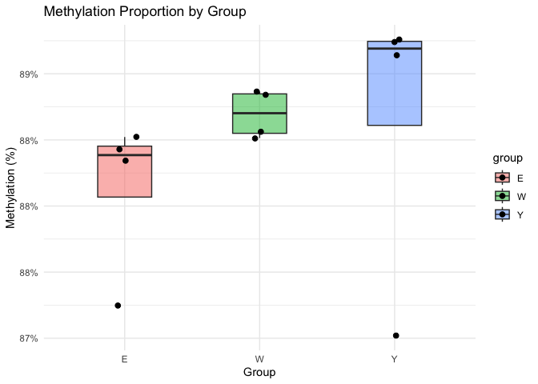
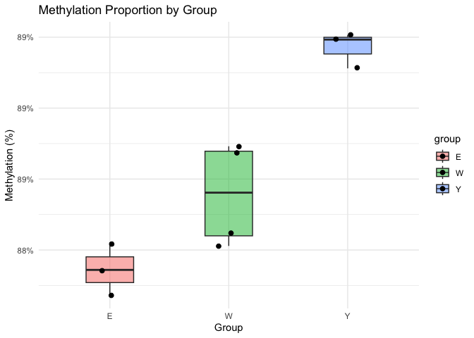
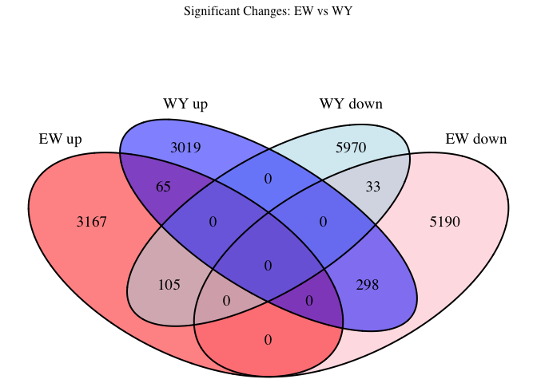
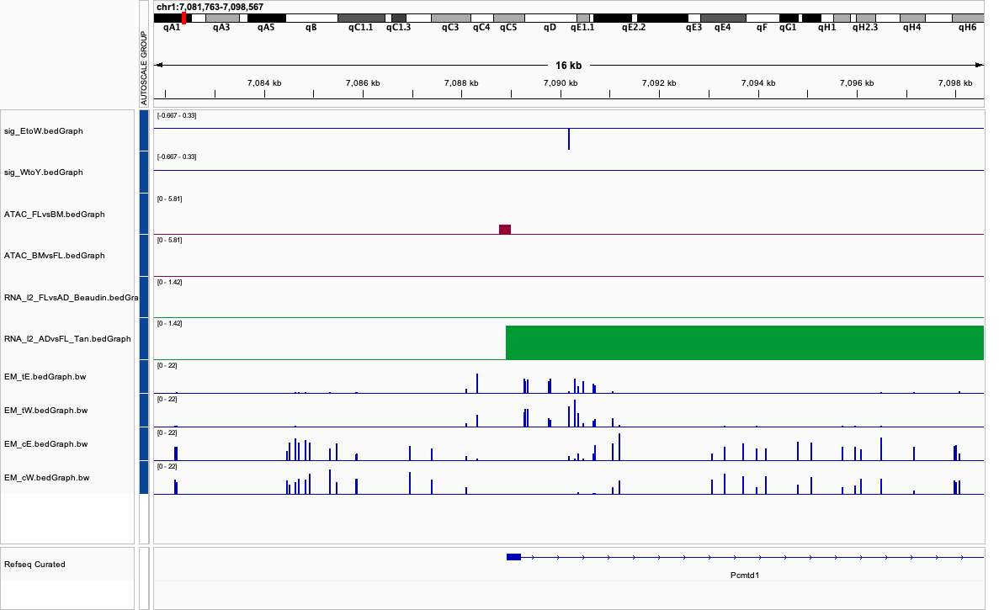
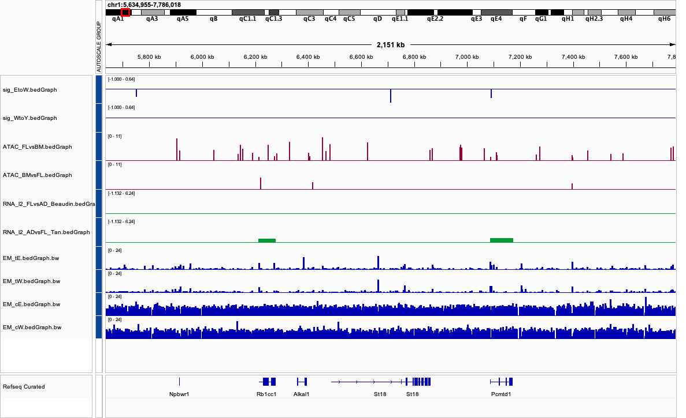

### Data

-   ‘Beaudin’ PMID 27666010 - DEGs comparing FL versus adult HSCs -
    positive FC values are enriched in FL, negative values in BM.
-   ‘Tan’ PMID 31851943 - DEGs comparing adult versus FL HSCs - positive
    FC values are enriched in ADULT, negative in FL (the other way
    around).
-   The ATAC-seq datasets are from PMID 35584393 - these are pseudobulk
    of the scATAC-seq from this paper. They are MACS readout files - one
    with peaks enriched in FL vs adult HSCs, the other adult vs FL HSCs.
    As a sanity check, there are more accessible regions in FL compared
    to adult HSCs as we would expect.

### Acronym

-   CpG: Count of methylated cytosines (C).
-   uCpG: Count of unmethylated cytosines (T).
-   p: Percentage of methylation, defined as CpG/(CpG + uCpG )
-   W: Week.
-   E: Embryo.

### Before Outlier Filtering

<table>
<caption>CpG and uCpG Counts with Methylation Proportions</caption>
<thead>
<tr>
<th style="text-align: left;">id</th>
<th style="text-align: right;">CpG</th>
<th style="text-align: right;">uCpG</th>
<th style="text-align: left;">group</th>
<th style="text-align: right;">prop</th>
</tr>
</thead>
<tbody>
<tr>
<td style="text-align: left;">Y1</td>
<td style="text-align: right;">4308615</td>
<td style="text-align: right;">642693</td>
<td style="text-align: left;">Y</td>
<td style="text-align: right;">0.8701973</td>
</tr>
<tr>
<td style="text-align: left;">Y2</td>
<td style="text-align: right;">25330027</td>
<td style="text-align: right;">3053642</td>
<td style="text-align: left;">Y</td>
<td style="text-align: right;">0.8924155</td>
</tr>
<tr>
<td style="text-align: left;">Y3</td>
<td style="text-align: right;">42007137</td>
<td style="text-align: right;">5055681</td>
<td style="text-align: left;">Y</td>
<td style="text-align: right;">0.8925759</td>
</tr>
<tr>
<td style="text-align: left;">Y4</td>
<td style="text-align: right;">40587466</td>
<td style="text-align: right;">4944743</td>
<td style="text-align: left;">Y</td>
<td style="text-align: right;">0.8914012</td>
</tr>
<tr>
<td style="text-align: left;">E1</td>
<td style="text-align: right;">21675688</td>
<td style="text-align: right;">2860849</td>
<td style="text-align: left;">E</td>
<td style="text-align: right;">0.8834045</td>
</tr>
<tr>
<td style="text-align: left;">E2</td>
<td style="text-align: right;">10002396</td>
<td style="text-align: right;">1461799</td>
<td style="text-align: left;">E</td>
<td style="text-align: right;">0.8724900</td>
</tr>
<tr>
<td style="text-align: left;">E3</td>
<td style="text-align: right;">43584903</td>
<td style="text-align: right;">5651380</td>
<td style="text-align: left;">E</td>
<td style="text-align: right;">0.8852192</td>
</tr>
<tr>
<td style="text-align: left;">E4</td>
<td style="text-align: right;">41349553</td>
<td style="text-align: right;">5410179</td>
<td style="text-align: left;">E</td>
<td style="text-align: right;">0.8842983</td>
</tr>
<tr>
<td style="text-align: left;">W1</td>
<td style="text-align: right;">38800768</td>
<td style="text-align: right;">4861527</td>
<td style="text-align: left;">W</td>
<td style="text-align: right;">0.8886562</td>
</tr>
<tr>
<td style="text-align: left;">W2</td>
<td style="text-align: right;">22889880</td>
<td style="text-align: right;">2956346</td>
<td style="text-align: left;">W</td>
<td style="text-align: right;">0.8856179</td>
</tr>
<tr>
<td style="text-align: left;">W3</td>
<td style="text-align: right;">22925819</td>
<td style="text-align: right;">2974891</td>
<td style="text-align: left;">W</td>
<td style="text-align: right;">0.8851425</td>
</tr>
<tr>
<td style="text-align: left;">W4</td>
<td style="text-align: right;">17946855</td>
<td style="text-align: right;">2253938</td>
<td style="text-align: left;">W</td>
<td style="text-align: right;">0.8884233</td>
</tr>
</tbody>
</table>

### After Outlier Filtering

    ## 
    ## Call:
    ## glm(formula = cbind(CpG, uCpG) ~ group, family = binomial, data = df)
    ## 
    ## Coefficients:
    ##              Estimate Std. Error z value Pr(>|z|)    
    ## (Intercept) 2.0356790  0.0002850 7143.54   <2e-16 ***
    ## groupW      0.0262660  0.0004094   64.16   <2e-16 ***
    ## groupY      0.0766544  0.0004088  187.53   <2e-16 ***
    ## ---
    ## Signif. codes:  0 '***' 0.001 '**' 0.01 '*' 0.05 '.' 0.1 ' ' 1
    ## 
    ## (Dispersion parameter for binomial family taken to be 1)
    ## 
    ##     Null deviance: 40116.8  on 9  degrees of freedom
    ## Residual deviance:  3888.9  on 7  degrees of freedom
    ## AIC: 4063.6
    ## 
    ## Number of Fisher Scoring iterations: 3

    ## Null deviance: 40117 on 9 degrees of freedom

    ## Residual deviance: 3889 on 7 degrees of freedom

    ## AIC: 4064

<table>
<caption>Estimated Methylation Proportions by Group (from GLM)</caption>
<thead>
<tr>
<th style="text-align: left;">Group</th>
<th style="text-align: right;">Estimated_Proportion</th>
</tr>
</thead>
<tbody>
<tr>
<td style="text-align: left;">E</td>
<td style="text-align: right;">0.8845</td>
</tr>
<tr>
<td style="text-align: left;">W</td>
<td style="text-align: right;">0.8871</td>
</tr>
<tr>
<td style="text-align: left;">Y</td>
<td style="text-align: right;">0.8921</td>
</tr>
</tbody>
</table>

### Differential Sites

<table>
<caption>Sig + EtoW Sites</caption>
<thead>
<tr>
<th style="text-align: left;">chrom</th>
<th style="text-align: right;">start</th>
<th style="text-align: right;">pvEW</th>
<th style="text-align: right;">l2EW</th>
<th style="text-align: right;">pvWY</th>
<th style="text-align: right;">l2WY</th>
</tr>
</thead>
<tbody>
<tr>
<td style="text-align: left;">chr1</td>
<td style="text-align: right;">13093457</td>
<td style="text-align: right;">0.0086081</td>
<td style="text-align: right;">Inf</td>
<td style="text-align: right;">0.3457786</td>
<td style="text-align: right;">-1.0000000</td>
</tr>
<tr>
<td style="text-align: left;">chr1</td>
<td style="text-align: right;">39579684</td>
<td style="text-align: right;">0.0000266</td>
<td style="text-align: right;">Inf</td>
<td style="text-align: right;">0.0583815</td>
<td style="text-align: right;">-0.8675497</td>
</tr>
<tr>
<td style="text-align: left;">chr1</td>
<td style="text-align: right;">40265227</td>
<td style="text-align: right;">0.0061801</td>
<td style="text-align: right;">Inf</td>
<td style="text-align: right;">0.6053968</td>
<td style="text-align: right;">-0.2854022</td>
</tr>
<tr>
<td style="text-align: left;">chr1</td>
<td style="text-align: right;">56942251</td>
<td style="text-align: right;">0.0041236</td>
<td style="text-align: right;">Inf</td>
<td style="text-align: right;">0.6170751</td>
<td style="text-align: right;">0.2370392</td>
</tr>
<tr>
<td style="text-align: left;">chr1</td>
<td style="text-align: right;">64867991</td>
<td style="text-align: right;">0.0051170</td>
<td style="text-align: right;">Inf</td>
<td style="text-align: right;">0.4878567</td>
<td style="text-align: right;">-0.8073549</td>
</tr>
<tr>
<td style="text-align: left;">chr1</td>
<td style="text-align: right;">72244563</td>
<td style="text-align: right;">0.0094235</td>
<td style="text-align: right;">Inf</td>
<td style="text-align: right;">0.5797174</td>
<td style="text-align: right;">-0.7655347</td>
</tr>
<tr>
<td style="text-align: left;">chr1</td>
<td style="text-align: right;">84915405</td>
<td style="text-align: right;">0.0021560</td>
<td style="text-align: right;">Inf</td>
<td style="text-align: right;">0.5981615</td>
<td style="text-align: right;">0.5849625</td>
</tr>
<tr>
<td style="text-align: left;">chr1</td>
<td style="text-align: right;">106072154</td>
<td style="text-align: right;">0.0037731</td>
<td style="text-align: right;">Inf</td>
<td style="text-align: right;">1.0000000</td>
<td style="text-align: right;">-0.0450879</td>
</tr>
<tr>
<td style="text-align: left;">chr1</td>
<td style="text-align: right;">106072182</td>
<td style="text-align: right;">0.0002918</td>
<td style="text-align: right;">Inf</td>
<td style="text-align: right;">0.4080213</td>
<td style="text-align: right;">-0.3625701</td>
</tr>
<tr>
<td style="text-align: left;">chr1</td>
<td style="text-align: right;">132272007</td>
<td style="text-align: right;">0.0013399</td>
<td style="text-align: right;">Inf</td>
<td style="text-align: right;">1.0000000</td>
<td style="text-align: right;">0.0484985</td>
</tr>
<tr>
<td style="text-align: left;">chr1</td>
<td style="text-align: right;">134510270</td>
<td style="text-align: right;">0.0049106</td>
<td style="text-align: right;">Inf</td>
<td style="text-align: right;">1.0000000</td>
<td style="text-align: right;">0.0159415</td>
</tr>
<tr>
<td style="text-align: left;">chr1</td>
<td style="text-align: right;">134510305</td>
<td style="text-align: right;">0.0079816</td>
<td style="text-align: right;">Inf</td>
<td style="text-align: right;">0.3106355</td>
<td style="text-align: right;">0.6035782</td>
</tr>
<tr>
<td style="text-align: left;">chr1</td>
<td style="text-align: right;">134653835</td>
<td style="text-align: right;">0.0010606</td>
<td style="text-align: right;">Inf</td>
<td style="text-align: right;">1.0000000</td>
<td style="text-align: right;">-0.0524674</td>
</tr>
<tr>
<td style="text-align: left;">chr1</td>
<td style="text-align: right;">159760836</td>
<td style="text-align: right;">0.0076955</td>
<td style="text-align: right;">Inf</td>
<td style="text-align: right;">0.6614547</td>
<td style="text-align: right;">-0.4594316</td>
</tr>
<tr>
<td style="text-align: left;">chr1</td>
<td style="text-align: right;">165633675</td>
<td style="text-align: right;">0.0002918</td>
<td style="text-align: right;">Inf</td>
<td style="text-align: right;">0.0438455</td>
<td style="text-align: right;">-1.7813597</td>
</tr>
<tr>
<td style="text-align: left;">chr1</td>
<td style="text-align: right;">166030971</td>
<td style="text-align: right;">0.0003857</td>
<td style="text-align: right;">Inf</td>
<td style="text-align: right;">1.0000000</td>
<td style="text-align: right;">0.0703893</td>
</tr>
<tr>
<td style="text-align: left;">chr1</td>
<td style="text-align: right;">167638232</td>
<td style="text-align: right;">0.0002236</td>
<td style="text-align: right;">Inf</td>
<td style="text-align: right;">0.1220888</td>
<td style="text-align: right;">-1.0995357</td>
</tr>
<tr>
<td style="text-align: left;">chr1</td>
<td style="text-align: right;">171380344</td>
<td style="text-align: right;">0.0056129</td>
<td style="text-align: right;">Inf</td>
<td style="text-align: right;">0.0971549</td>
<td style="text-align: right;">-1.8479969</td>
</tr>
<tr>
<td style="text-align: left;">chr1</td>
<td style="text-align: right;">172054598</td>
<td style="text-align: right;">0.0034081</td>
<td style="text-align: right;">Inf</td>
<td style="text-align: right;">0.8671012</td>
<td style="text-align: right;">-0.3625701</td>
</tr>
<tr>
<td style="text-align: left;">chr1</td>
<td style="text-align: right;">185171034</td>
<td style="text-align: right;">0.0073169</td>
<td style="text-align: right;">Inf</td>
<td style="text-align: right;">1.0000000</td>
<td style="text-align: right;">0.0000000</td>
</tr>
</tbody>
</table>

<table>
<caption>Sig - EtoW Sites</caption>
<thead>
<tr>
<th style="text-align: left;">chrom</th>
<th style="text-align: right;">start</th>
<th style="text-align: right;">pvEW</th>
<th style="text-align: right;">l2EW</th>
<th style="text-align: right;">pvWY</th>
<th style="text-align: right;">l2WY</th>
</tr>
</thead>
<tbody>
<tr>
<td style="text-align: left;">chr1</td>
<td style="text-align: right;">6710488</td>
<td style="text-align: right;">0.0076955</td>
<td style="text-align: right;">-Inf</td>
<td style="text-align: right;">0.0704243</td>
<td style="text-align: right;">Inf</td>
</tr>
<tr>
<td style="text-align: left;">chr1</td>
<td style="text-align: right;">7090166</td>
<td style="text-align: right;">0.0020871</td>
<td style="text-align: right;">-Inf</td>
<td style="text-align: right;">0.8911616</td>
<td style="text-align: right;">Inf</td>
</tr>
<tr>
<td style="text-align: left;">chr1</td>
<td style="text-align: right;">10037300</td>
<td style="text-align: right;">0.0059235</td>
<td style="text-align: right;">-Inf</td>
<td style="text-align: right;">NA</td>
<td style="text-align: right;">NA</td>
</tr>
<tr>
<td style="text-align: left;">chr1</td>
<td style="text-align: right;">14308003</td>
<td style="text-align: right;">0.0000459</td>
<td style="text-align: right;">-Inf</td>
<td style="text-align: right;">NA</td>
<td style="text-align: right;">NA</td>
</tr>
<tr>
<td style="text-align: left;">chr1</td>
<td style="text-align: right;">34006603</td>
<td style="text-align: right;">0.0030437</td>
<td style="text-align: right;">-Inf</td>
<td style="text-align: right;">NA</td>
<td style="text-align: right;">NA</td>
</tr>
<tr>
<td style="text-align: left;">chr1</td>
<td style="text-align: right;">34504496</td>
<td style="text-align: right;">0.0078319</td>
<td style="text-align: right;">-Inf</td>
<td style="text-align: right;">0.2458150</td>
<td style="text-align: right;">Inf</td>
</tr>
<tr>
<td style="text-align: left;">chr1</td>
<td style="text-align: right;">37697317</td>
<td style="text-align: right;">0.0012141</td>
<td style="text-align: right;">-Inf</td>
<td style="text-align: right;">0.9698723</td>
<td style="text-align: right;">Inf</td>
</tr>
<tr>
<td style="text-align: left;">chr1</td>
<td style="text-align: right;">37725990</td>
<td style="text-align: right;">0.0020871</td>
<td style="text-align: right;">-Inf</td>
<td style="text-align: right;">NA</td>
<td style="text-align: right;">NA</td>
</tr>
<tr>
<td style="text-align: left;">chr1</td>
<td style="text-align: right;">38580680</td>
<td style="text-align: right;">0.0024812</td>
<td style="text-align: right;">-Inf</td>
<td style="text-align: right;">NA</td>
<td style="text-align: right;">NA</td>
</tr>
<tr>
<td style="text-align: left;">chr1</td>
<td style="text-align: right;">38663074</td>
<td style="text-align: right;">0.0024367</td>
<td style="text-align: right;">-Inf</td>
<td style="text-align: right;">NA</td>
<td style="text-align: right;">NA</td>
</tr>
<tr>
<td style="text-align: left;">chr1</td>
<td style="text-align: right;">39251842</td>
<td style="text-align: right;">0.0009330</td>
<td style="text-align: right;">-Inf</td>
<td style="text-align: right;">NA</td>
<td style="text-align: right;">NA</td>
</tr>
<tr>
<td style="text-align: left;">chr1</td>
<td style="text-align: right;">39545653</td>
<td style="text-align: right;">0.0011385</td>
<td style="text-align: right;">-Inf</td>
<td style="text-align: right;">NA</td>
<td style="text-align: right;">NA</td>
</tr>
<tr>
<td style="text-align: left;">chr1</td>
<td style="text-align: right;">39545666</td>
<td style="text-align: right;">0.0001663</td>
<td style="text-align: right;">-Inf</td>
<td style="text-align: right;">NA</td>
<td style="text-align: right;">NA</td>
</tr>
<tr>
<td style="text-align: left;">chr1</td>
<td style="text-align: right;">40240762</td>
<td style="text-align: right;">0.0012515</td>
<td style="text-align: right;">-Inf</td>
<td style="text-align: right;">0.0119619</td>
<td style="text-align: right;">Inf</td>
</tr>
<tr>
<td style="text-align: left;">chr1</td>
<td style="text-align: right;">44513045</td>
<td style="text-align: right;">0.0039048</td>
<td style="text-align: right;">-Inf</td>
<td style="text-align: right;">NA</td>
<td style="text-align: right;">NA</td>
</tr>
<tr>
<td style="text-align: left;">chr1</td>
<td style="text-align: right;">49224447</td>
<td style="text-align: right;">0.0082841</td>
<td style="text-align: right;">-Inf</td>
<td style="text-align: right;">0.0034500</td>
<td style="text-align: right;">Inf</td>
</tr>
<tr>
<td style="text-align: left;">chr1</td>
<td style="text-align: right;">53662590</td>
<td style="text-align: right;">0.0051873</td>
<td style="text-align: right;">-Inf</td>
<td style="text-align: right;">0.0512295</td>
<td style="text-align: right;">Inf</td>
</tr>
<tr>
<td style="text-align: left;">chr1</td>
<td style="text-align: right;">53846102</td>
<td style="text-align: right;">0.0003991</td>
<td style="text-align: right;">-Inf</td>
<td style="text-align: right;">NA</td>
<td style="text-align: right;">NA</td>
</tr>
<tr>
<td style="text-align: left;">chr1</td>
<td style="text-align: right;">53986612</td>
<td style="text-align: right;">0.0013726</td>
<td style="text-align: right;">-Inf</td>
<td style="text-align: right;">NA</td>
<td style="text-align: right;">NA</td>
</tr>
<tr>
<td style="text-align: left;">chr1</td>
<td style="text-align: right;">55202253</td>
<td style="text-align: right;">0.0021686</td>
<td style="text-align: right;">-Inf</td>
<td style="text-align: right;">NA</td>
<td style="text-align: right;">NA</td>
</tr>
</tbody>
</table>

IGV SnapShots: 

<table style="width:100%;">
<caption>CpG Methyl Proportions at Promoter Ordered by FLvsAD
RNA</caption>
<colgroup>
<col style="width: 8%" />
<col style="width: 5%" />
<col style="width: 6%" />
<col style="width: 9%" />
<col style="width: 9%" />
<col style="width: 10%" />
<col style="width: 3%" />
<col style="width: 2%" />
<col style="width: 3%" />
<col style="width: 2%" />
<col style="width: 3%" />
<col style="width: 2%" />
<col style="width: 9%" />
<col style="width: 9%" />
<col style="width: 9%" />
</colgroup>
<thead>
<tr>
<th style="text-align: left;">Name</th>
<th style="text-align: left;">chrom</th>
<th style="text-align: left;">strand</th>
<th style="text-align: right;">tss</th>
<th style="text-align: right;">l2_FLvsAD</th>
<th style="text-align: right;">l2_ADvsFL</th>
<th style="text-align: right;">cE</th>
<th style="text-align: right;">tE</th>
<th style="text-align: right;">cW</th>
<th style="text-align: right;">tW</th>
<th style="text-align: right;">cY</th>
<th style="text-align: right;">tY</th>
<th style="text-align: right;">pE</th>
<th style="text-align: right;">pW</th>
<th style="text-align: right;">pY</th>
</tr>
</thead>
<tbody>
<tr>
<td style="text-align: left;">Igf2bp1</td>
<td style="text-align: left;">chr11</td>
<td style="text-align: left;">-</td>
<td style="text-align: right;">96005943</td>
<td style="text-align: right;">13.878110</td>
<td style="text-align: right;">-8.792279</td>
<td style="text-align: right;">0</td>
<td style="text-align: right;">21</td>
<td style="text-align: right;">0</td>
<td style="text-align: right;">0</td>
<td style="text-align: right;">4</td>
<td style="text-align: right;">18</td>
<td style="text-align: right;">0.0000000</td>
<td style="text-align: right;">0.0000000</td>
<td style="text-align: right;">0.1818182</td>
</tr>
<tr>
<td style="text-align: left;">Pklr</td>
<td style="text-align: left;">chr3</td>
<td style="text-align: left;">+</td>
<td style="text-align: right;">89136141</td>
<td style="text-align: right;">13.118240</td>
<td style="text-align: right;">-4.855937</td>
<td style="text-align: right;">30</td>
<td style="text-align: right;">1</td>
<td style="text-align: right;">29</td>
<td style="text-align: right;">8</td>
<td style="text-align: right;">39</td>
<td style="text-align: right;">6</td>
<td style="text-align: right;">0.9677419</td>
<td style="text-align: right;">0.9666667</td>
<td style="text-align: right;">0.8666667</td>
</tr>
<tr>
<td style="text-align: left;">Hba-a1</td>
<td style="text-align: left;">chr11</td>
<td style="text-align: left;">+</td>
<td style="text-align: right;">32283671</td>
<td style="text-align: right;">10.713923</td>
<td style="text-align: right;">-7.531318</td>
<td style="text-align: right;">5</td>
<td style="text-align: right;">6</td>
<td style="text-align: right;">10</td>
<td style="text-align: right;">2</td>
<td style="text-align: right;">8</td>
<td style="text-align: right;">1</td>
<td style="text-align: right;">0.4545455</td>
<td style="text-align: right;">0.6250000</td>
<td style="text-align: right;">0.8888889</td>
</tr>
<tr>
<td style="text-align: left;">Hba-a2</td>
<td style="text-align: left;">chr11</td>
<td style="text-align: left;">+</td>
<td style="text-align: right;">32283674</td>
<td style="text-align: right;">10.713923</td>
<td style="text-align: right;">-7.531318</td>
<td style="text-align: right;">5</td>
<td style="text-align: right;">6</td>
<td style="text-align: right;">10</td>
<td style="text-align: right;">2</td>
<td style="text-align: right;">8</td>
<td style="text-align: right;">1</td>
<td style="text-align: right;">0.4545455</td>
<td style="text-align: right;">0.6250000</td>
<td style="text-align: right;">0.8888889</td>
</tr>
<tr>
<td style="text-align: left;">Mir675</td>
<td style="text-align: left;">chr7</td>
<td style="text-align: left;">-</td>
<td style="text-align: right;">142577146</td>
<td style="text-align: right;">10.636798</td>
<td style="text-align: right;">-7.869497</td>
<td style="text-align: right;">187</td>
<td style="text-align: right;">37</td>
<td style="text-align: right;">187</td>
<td style="text-align: right;">11</td>
<td style="text-align: right;">176</td>
<td style="text-align: right;">5</td>
<td style="text-align: right;">0.8348214</td>
<td style="text-align: right;">0.8348214</td>
<td style="text-align: right;">0.9723757</td>
</tr>
<tr>
<td style="text-align: left;">Slc30a10</td>
<td style="text-align: left;">chr1</td>
<td style="text-align: left;">+</td>
<td style="text-align: right;">185454847</td>
<td style="text-align: right;">10.364844</td>
<td style="text-align: right;">-7.913804</td>
<td style="text-align: right;">41</td>
<td style="text-align: right;">9</td>
<td style="text-align: right;">42</td>
<td style="text-align: right;">14</td>
<td style="text-align: right;">40</td>
<td style="text-align: right;">10</td>
<td style="text-align: right;">0.8200000</td>
<td style="text-align: right;">0.8235294</td>
<td style="text-align: right;">0.8000000</td>
</tr>
<tr>
<td style="text-align: left;">H19</td>
<td style="text-align: left;">chr7</td>
<td style="text-align: left;">-</td>
<td style="text-align: right;">142578145</td>
<td style="text-align: right;">10.256493</td>
<td style="text-align: right;">-6.814385</td>
<td style="text-align: right;">64</td>
<td style="text-align: right;">14</td>
<td style="text-align: right;">59</td>
<td style="text-align: right;">6</td>
<td style="text-align: right;">56</td>
<td style="text-align: right;">2</td>
<td style="text-align: right;">0.8205128</td>
<td style="text-align: right;">0.8082192</td>
<td style="text-align: right;">0.9655172</td>
</tr>
<tr>
<td style="text-align: left;">Slc4a1</td>
<td style="text-align: left;">chr11</td>
<td style="text-align: left;">-</td>
<td style="text-align: right;">102365280</td>
<td style="text-align: right;">10.156983</td>
<td style="text-align: right;">-10.644562</td>
<td style="text-align: right;">70</td>
<td style="text-align: right;">13</td>
<td style="text-align: right;">87</td>
<td style="text-align: right;">15</td>
<td style="text-align: right;">90</td>
<td style="text-align: right;">11</td>
<td style="text-align: right;">0.8433735</td>
<td style="text-align: right;">0.8700000</td>
<td style="text-align: right;">0.8910891</td>
</tr>
<tr>
<td style="text-align: left;">Tspo2</td>
<td style="text-align: left;">chr17</td>
<td style="text-align: left;">-</td>
<td style="text-align: right;">48451500</td>
<td style="text-align: right;">10.147016</td>
<td style="text-align: right;">-3.136795</td>
<td style="text-align: right;">96</td>
<td style="text-align: right;">16</td>
<td style="text-align: right;">84</td>
<td style="text-align: right;">11</td>
<td style="text-align: right;">55</td>
<td style="text-align: right;">7</td>
<td style="text-align: right;">0.8571429</td>
<td style="text-align: right;">0.8400000</td>
<td style="text-align: right;">0.8870968</td>
</tr>
<tr>
<td style="text-align: left;">Cldn13</td>
<td style="text-align: left;">chr5</td>
<td style="text-align: left;">-</td>
<td style="text-align: right;">134915529</td>
<td style="text-align: right;">10.101184</td>
<td style="text-align: right;">-4.253341</td>
<td style="text-align: right;">296</td>
<td style="text-align: right;">11</td>
<td style="text-align: right;">258</td>
<td style="text-align: right;">13</td>
<td style="text-align: right;">226</td>
<td style="text-align: right;">16</td>
<td style="text-align: right;">0.9641694</td>
<td style="text-align: right;">0.9591078</td>
<td style="text-align: right;">0.9338843</td>
</tr>
<tr>
<td style="text-align: left;">Ermap</td>
<td style="text-align: left;">chr4</td>
<td style="text-align: left;">-</td>
<td style="text-align: right;">119189994</td>
<td style="text-align: right;">10.027415</td>
<td style="text-align: right;">-3.824257</td>
<td style="text-align: right;">202</td>
<td style="text-align: right;">25</td>
<td style="text-align: right;">180</td>
<td style="text-align: right;">18</td>
<td style="text-align: right;">146</td>
<td style="text-align: right;">7</td>
<td style="text-align: right;">0.8898678</td>
<td style="text-align: right;">0.8780488</td>
<td style="text-align: right;">0.9542484</td>
</tr>
<tr>
<td style="text-align: left;">Hbb-bs</td>
<td style="text-align: left;">chr7</td>
<td style="text-align: left;">-</td>
<td style="text-align: right;">103827927</td>
<td style="text-align: right;">9.787497</td>
<td style="text-align: right;">-10.364109</td>
<td style="text-align: right;">11</td>
<td style="text-align: right;">0</td>
<td style="text-align: right;">14</td>
<td style="text-align: right;">0</td>
<td style="text-align: right;">11</td>
<td style="text-align: right;">0</td>
<td style="text-align: right;">1.0000000</td>
<td style="text-align: right;">1.0000000</td>
<td style="text-align: right;">1.0000000</td>
</tr>
<tr>
<td style="text-align: left;">Hbb-b1</td>
<td style="text-align: left;">chr7</td>
<td style="text-align: left;">-</td>
<td style="text-align: right;">103827928</td>
<td style="text-align: right;">9.787497</td>
<td style="text-align: right;">-10.364109</td>
<td style="text-align: right;">11</td>
<td style="text-align: right;">0</td>
<td style="text-align: right;">14</td>
<td style="text-align: right;">0</td>
<td style="text-align: right;">11</td>
<td style="text-align: right;">0</td>
<td style="text-align: right;">1.0000000</td>
<td style="text-align: right;">1.0000000</td>
<td style="text-align: right;">1.0000000</td>
</tr>
<tr>
<td style="text-align: left;">Clec14a</td>
<td style="text-align: left;">chr12</td>
<td style="text-align: left;">-</td>
<td style="text-align: right;">58269257</td>
<td style="text-align: right;">9.574238</td>
<td style="text-align: right;">NA</td>
<td style="text-align: right;">33</td>
<td style="text-align: right;">2</td>
<td style="text-align: right;">27</td>
<td style="text-align: right;">0</td>
<td style="text-align: right;">7</td>
<td style="text-align: right;">3</td>
<td style="text-align: right;">0.9428571</td>
<td style="text-align: right;">0.9310345</td>
<td style="text-align: right;">0.7000000</td>
</tr>
<tr>
<td style="text-align: left;">Pde3a</td>
<td style="text-align: left;">chr6</td>
<td style="text-align: left;">+</td>
<td style="text-align: right;">141249268</td>
<td style="text-align: right;">9.532430</td>
<td style="text-align: right;">-1.933243</td>
<td style="text-align: right;">0</td>
<td style="text-align: right;">20</td>
<td style="text-align: right;">1</td>
<td style="text-align: right;">29</td>
<td style="text-align: right;">0</td>
<td style="text-align: right;">21</td>
<td style="text-align: right;">0.0000000</td>
<td style="text-align: right;">0.0476190</td>
<td style="text-align: right;">0.0000000</td>
</tr>
<tr>
<td style="text-align: left;">Cecr2</td>
<td style="text-align: left;">chr6</td>
<td style="text-align: left;">+</td>
<td style="text-align: right;">120666313</td>
<td style="text-align: right;">9.514186</td>
<td style="text-align: right;">-5.865640</td>
<td style="text-align: right;">0</td>
<td style="text-align: right;">87</td>
<td style="text-align: right;">3</td>
<td style="text-align: right;">85</td>
<td style="text-align: right;">0</td>
<td style="text-align: right;">32</td>
<td style="text-align: right;">0.0000000</td>
<td style="text-align: right;">0.0333333</td>
<td style="text-align: right;">0.0000000</td>
</tr>
<tr>
<td style="text-align: left;">Prss50</td>
<td style="text-align: left;">chr9</td>
<td style="text-align: left;">+</td>
<td style="text-align: right;">110857963</td>
<td style="text-align: right;">9.459658</td>
<td style="text-align: right;">-2.828423</td>
<td style="text-align: right;">35</td>
<td style="text-align: right;">44</td>
<td style="text-align: right;">43</td>
<td style="text-align: right;">68</td>
<td style="text-align: right;">36</td>
<td style="text-align: right;">43</td>
<td style="text-align: right;">0.4430380</td>
<td style="text-align: right;">0.4942529</td>
<td style="text-align: right;">0.4556962</td>
</tr>
<tr>
<td style="text-align: left;">Stfa1</td>
<td style="text-align: left;">chr16</td>
<td style="text-align: left;">+</td>
<td style="text-align: right;">36277147</td>
<td style="text-align: right;">9.357359</td>
<td style="text-align: right;">-11.054441</td>
<td style="text-align: right;">179</td>
<td style="text-align: right;">9</td>
<td style="text-align: right;">173</td>
<td style="text-align: right;">8</td>
<td style="text-align: right;">181</td>
<td style="text-align: right;">16</td>
<td style="text-align: right;">0.9521277</td>
<td style="text-align: right;">0.9505495</td>
<td style="text-align: right;">0.9187817</td>
</tr>
<tr>
<td style="text-align: left;">Mir3063</td>
<td style="text-align: left;">chr11</td>
<td style="text-align: left;">-</td>
<td style="text-align: right;">95963382</td>
<td style="text-align: right;">9.293235</td>
<td style="text-align: right;">-8.568410</td>
<td style="text-align: right;">193</td>
<td style="text-align: right;">9</td>
<td style="text-align: right;">160</td>
<td style="text-align: right;">6</td>
<td style="text-align: right;">184</td>
<td style="text-align: right;">6</td>
<td style="text-align: right;">0.9554455</td>
<td style="text-align: right;">0.9467456</td>
<td style="text-align: right;">0.9684211</td>
</tr>
<tr>
<td style="text-align: left;">Cd5l</td>
<td style="text-align: left;">chr3</td>
<td style="text-align: left;">+</td>
<td style="text-align: right;">87357880</td>
<td style="text-align: right;">9.289424</td>
<td style="text-align: right;">-6.731174</td>
<td style="text-align: right;">111</td>
<td style="text-align: right;">3</td>
<td style="text-align: right;">97</td>
<td style="text-align: right;">2</td>
<td style="text-align: right;">115</td>
<td style="text-align: right;">3</td>
<td style="text-align: right;">0.9736842</td>
<td style="text-align: right;">0.9700000</td>
<td style="text-align: right;">0.9745763</td>
</tr>
</tbody>
</table>

<table style="width:100%;">
<caption>CpG Methyl Proportions at Promoter Ordered by - FLvsAD
RNA</caption>
<colgroup>
<col style="width: 12%" />
<col style="width: 5%" />
<col style="width: 6%" />
<col style="width: 8%" />
<col style="width: 9%" />
<col style="width: 8%" />
<col style="width: 3%" />
<col style="width: 3%" />
<col style="width: 3%" />
<col style="width: 3%" />
<col style="width: 3%" />
<col style="width: 3%" />
<col style="width: 8%" />
<col style="width: 8%" />
<col style="width: 8%" />
</colgroup>
<thead>
<tr>
<th style="text-align: left;">Name</th>
<th style="text-align: left;">chrom</th>
<th style="text-align: left;">strand</th>
<th style="text-align: right;">tss</th>
<th style="text-align: right;">l2_FLvsAD</th>
<th style="text-align: right;">l2_ADvsFL</th>
<th style="text-align: right;">cE</th>
<th style="text-align: right;">tE</th>
<th style="text-align: right;">cW</th>
<th style="text-align: right;">tW</th>
<th style="text-align: right;">cY</th>
<th style="text-align: right;">tY</th>
<th style="text-align: right;">pE</th>
<th style="text-align: right;">pW</th>
<th style="text-align: right;">pY</th>
</tr>
</thead>
<tbody>
<tr>
<td style="text-align: left;">Scin</td>
<td style="text-align: left;">chr12</td>
<td style="text-align: left;">-</td>
<td style="text-align: right;">40134227</td>
<td style="text-align: right;">-10.348908</td>
<td style="text-align: right;">NA</td>
<td style="text-align: right;">175</td>
<td style="text-align: right;">228</td>
<td style="text-align: right;">138</td>
<td style="text-align: right;">233</td>
<td style="text-align: right;">169</td>
<td style="text-align: right;">179</td>
<td style="text-align: right;">0.4342432</td>
<td style="text-align: right;">0.3770492</td>
<td style="text-align: right;">0.4856322</td>
</tr>
<tr>
<td style="text-align: left;">Gzmb</td>
<td style="text-align: left;">chr14</td>
<td style="text-align: left;">-</td>
<td style="text-align: right;">56262333</td>
<td style="text-align: right;">-8.811065</td>
<td style="text-align: right;">NA</td>
<td style="text-align: right;">73</td>
<td style="text-align: right;">12</td>
<td style="text-align: right;">40</td>
<td style="text-align: right;">6</td>
<td style="text-align: right;">93</td>
<td style="text-align: right;">13</td>
<td style="text-align: right;">0.8588235</td>
<td style="text-align: right;">0.7692308</td>
<td style="text-align: right;">0.8773585</td>
</tr>
<tr>
<td style="text-align: left;">Tsix</td>
<td style="text-align: left;">chrX</td>
<td style="text-align: left;">+</td>
<td style="text-align: right;">103431516</td>
<td style="text-align: right;">-7.795111</td>
<td style="text-align: right;">1.284681</td>
<td style="text-align: right;">43</td>
<td style="text-align: right;">1</td>
<td style="text-align: right;">60</td>
<td style="text-align: right;">3</td>
<td style="text-align: right;">40</td>
<td style="text-align: right;">0</td>
<td style="text-align: right;">0.9772727</td>
<td style="text-align: right;">0.9836066</td>
<td style="text-align: right;">1.0000000</td>
</tr>
<tr>
<td style="text-align: left;">Cbr3</td>
<td style="text-align: left;">chr16</td>
<td style="text-align: left;">+</td>
<td style="text-align: right;">93683218</td>
<td style="text-align: right;">-7.743177</td>
<td style="text-align: right;">NA</td>
<td style="text-align: right;">0</td>
<td style="text-align: right;">106</td>
<td style="text-align: right;">0</td>
<td style="text-align: right;">132</td>
<td style="text-align: right;">5</td>
<td style="text-align: right;">150</td>
<td style="text-align: right;">0.0000000</td>
<td style="text-align: right;">0.0000000</td>
<td style="text-align: right;">0.0322581</td>
</tr>
<tr>
<td style="text-align: left;">Fcer1a</td>
<td style="text-align: left;">chr1</td>
<td style="text-align: left;">-</td>
<td style="text-align: right;">173227228</td>
<td style="text-align: right;">-7.625806</td>
<td style="text-align: right;">NA</td>
<td style="text-align: right;">108</td>
<td style="text-align: right;">9</td>
<td style="text-align: right;">97</td>
<td style="text-align: right;">14</td>
<td style="text-align: right;">123</td>
<td style="text-align: right;">8</td>
<td style="text-align: right;">0.9230769</td>
<td style="text-align: right;">0.9150943</td>
<td style="text-align: right;">0.9389313</td>
</tr>
<tr>
<td style="text-align: left;">Dusp15</td>
<td style="text-align: left;">chr2</td>
<td style="text-align: left;">-</td>
<td style="text-align: right;">152951581</td>
<td style="text-align: right;">-7.124861</td>
<td style="text-align: right;">NA</td>
<td style="text-align: right;">4</td>
<td style="text-align: right;">12</td>
<td style="text-align: right;">2</td>
<td style="text-align: right;">8</td>
<td style="text-align: right;">0</td>
<td style="text-align: right;">12</td>
<td style="text-align: right;">0.2500000</td>
<td style="text-align: right;">0.1428571</td>
<td style="text-align: right;">0.0000000</td>
</tr>
<tr>
<td style="text-align: left;">Aldh1a1</td>
<td style="text-align: left;">chr19</td>
<td style="text-align: left;">+</td>
<td style="text-align: right;">20492582</td>
<td style="text-align: right;">-6.847990</td>
<td style="text-align: right;">8.344525</td>
<td style="text-align: right;">18</td>
<td style="text-align: right;">6</td>
<td style="text-align: right;">20</td>
<td style="text-align: right;">7</td>
<td style="text-align: right;">11</td>
<td style="text-align: right;">3</td>
<td style="text-align: right;">0.7500000</td>
<td style="text-align: right;">0.7692308</td>
<td style="text-align: right;">0.7857143</td>
</tr>
<tr>
<td style="text-align: left;">H2-Q7</td>
<td style="text-align: left;">chr17</td>
<td style="text-align: left;">+</td>
<td style="text-align: right;">35439154</td>
<td style="text-align: right;">-6.814539</td>
<td style="text-align: right;">6.200380</td>
<td style="text-align: right;">271</td>
<td style="text-align: right;">686</td>
<td style="text-align: right;">410</td>
<td style="text-align: right;">626</td>
<td style="text-align: right;">282</td>
<td style="text-align: right;">562</td>
<td style="text-align: right;">0.2831766</td>
<td style="text-align: right;">0.3740876</td>
<td style="text-align: right;">0.3341232</td>
</tr>
<tr>
<td style="text-align: left;">H2-Q9</td>
<td style="text-align: left;">chr17</td>
<td style="text-align: left;">+</td>
<td style="text-align: right;">35439166</td>
<td style="text-align: right;">-6.814539</td>
<td style="text-align: right;">6.200380</td>
<td style="text-align: right;">282</td>
<td style="text-align: right;">705</td>
<td style="text-align: right;">439</td>
<td style="text-align: right;">633</td>
<td style="text-align: right;">296</td>
<td style="text-align: right;">574</td>
<td style="text-align: right;">0.2857143</td>
<td style="text-align: right;">0.3837413</td>
<td style="text-align: right;">0.3402299</td>
</tr>
<tr>
<td style="text-align: left;">A330041J22Rik</td>
<td style="text-align: left;">chr9</td>
<td style="text-align: left;">+</td>
<td style="text-align: right;">86695441</td>
<td style="text-align: right;">-6.742050</td>
<td style="text-align: right;">NA</td>
<td style="text-align: right;">22</td>
<td style="text-align: right;">19</td>
<td style="text-align: right;">21</td>
<td style="text-align: right;">23</td>
<td style="text-align: right;">15</td>
<td style="text-align: right;">12</td>
<td style="text-align: right;">0.5365854</td>
<td style="text-align: right;">0.5250000</td>
<td style="text-align: right;">0.5555556</td>
</tr>
<tr>
<td style="text-align: left;">Gm5833</td>
<td style="text-align: left;">chr1</td>
<td style="text-align: left;">-</td>
<td style="text-align: right;">138682074</td>
<td style="text-align: right;">-6.680762</td>
<td style="text-align: right;">NA</td>
<td style="text-align: right;">189</td>
<td style="text-align: right;">21</td>
<td style="text-align: right;">121</td>
<td style="text-align: right;">32</td>
<td style="text-align: right;">144</td>
<td style="text-align: right;">86</td>
<td style="text-align: right;">0.9000000</td>
<td style="text-align: right;">0.8521127</td>
<td style="text-align: right;">0.6260870</td>
</tr>
<tr>
<td style="text-align: left;">Cacng8</td>
<td style="text-align: left;">chr7</td>
<td style="text-align: left;">+</td>
<td style="text-align: right;">3394041</td>
<td style="text-align: right;">-6.524966</td>
<td style="text-align: right;">NA</td>
<td style="text-align: right;">135</td>
<td style="text-align: right;">1</td>
<td style="text-align: right;">83</td>
<td style="text-align: right;">6</td>
<td style="text-align: right;">97</td>
<td style="text-align: right;">0</td>
<td style="text-align: right;">0.9926471</td>
<td style="text-align: right;">0.9880952</td>
<td style="text-align: right;">1.0000000</td>
</tr>
<tr>
<td style="text-align: left;">Gdf15</td>
<td style="text-align: left;">chr8</td>
<td style="text-align: left;">-</td>
<td style="text-align: right;">70632455</td>
<td style="text-align: right;">-6.244124</td>
<td style="text-align: right;">NA</td>
<td style="text-align: right;">148</td>
<td style="text-align: right;">8</td>
<td style="text-align: right;">111</td>
<td style="text-align: right;">5</td>
<td style="text-align: right;">143</td>
<td style="text-align: right;">8</td>
<td style="text-align: right;">0.9487179</td>
<td style="text-align: right;">0.9327731</td>
<td style="text-align: right;">0.9470199</td>
</tr>
<tr>
<td style="text-align: left;">Rab19</td>
<td style="text-align: left;">chr6</td>
<td style="text-align: left;">+</td>
<td style="text-align: right;">39381352</td>
<td style="text-align: right;">-6.226537</td>
<td style="text-align: right;">NA</td>
<td style="text-align: right;">45</td>
<td style="text-align: right;">33</td>
<td style="text-align: right;">31</td>
<td style="text-align: right;">18</td>
<td style="text-align: right;">36</td>
<td style="text-align: right;">20</td>
<td style="text-align: right;">0.5769231</td>
<td style="text-align: right;">0.4843750</td>
<td style="text-align: right;">0.6428571</td>
</tr>
<tr>
<td style="text-align: left;">H2-Q8</td>
<td style="text-align: left;">chr17</td>
<td style="text-align: left;">+</td>
<td style="text-align: right;">35424846</td>
<td style="text-align: right;">-6.023789</td>
<td style="text-align: right;">7.315861</td>
<td style="text-align: right;">205</td>
<td style="text-align: right;">675</td>
<td style="text-align: right;">285</td>
<td style="text-align: right;">550</td>
<td style="text-align: right;">141</td>
<td style="text-align: right;">645</td>
<td style="text-align: right;">0.2329545</td>
<td style="text-align: right;">0.2968750</td>
<td style="text-align: right;">0.1793893</td>
</tr>
<tr>
<td style="text-align: left;">H2-Q6</td>
<td style="text-align: left;">chr17</td>
<td style="text-align: left;">+</td>
<td style="text-align: right;">35424849</td>
<td style="text-align: right;">-6.023789</td>
<td style="text-align: right;">7.315861</td>
<td style="text-align: right;">205</td>
<td style="text-align: right;">675</td>
<td style="text-align: right;">285</td>
<td style="text-align: right;">550</td>
<td style="text-align: right;">141</td>
<td style="text-align: right;">645</td>
<td style="text-align: right;">0.2329545</td>
<td style="text-align: right;">0.2968750</td>
<td style="text-align: right;">0.1793893</td>
</tr>
<tr>
<td style="text-align: left;">Cd163</td>
<td style="text-align: left;">chr6</td>
<td style="text-align: left;">+</td>
<td style="text-align: right;">124304650</td>
<td style="text-align: right;">-5.996193</td>
<td style="text-align: right;">NA</td>
<td style="text-align: right;">86</td>
<td style="text-align: right;">5</td>
<td style="text-align: right;">66</td>
<td style="text-align: right;">2</td>
<td style="text-align: right;">62</td>
<td style="text-align: right;">2</td>
<td style="text-align: right;">0.9450549</td>
<td style="text-align: right;">0.9295775</td>
<td style="text-align: right;">0.9687500</td>
</tr>
<tr>
<td style="text-align: left;">2410004P03Rik</td>
<td style="text-align: left;">chr12</td>
<td style="text-align: left;">-</td>
<td style="text-align: right;">17011726</td>
<td style="text-align: right;">-5.968840</td>
<td style="text-align: right;">NA</td>
<td style="text-align: right;">13</td>
<td style="text-align: right;">14</td>
<td style="text-align: right;">15</td>
<td style="text-align: right;">18</td>
<td style="text-align: right;">5</td>
<td style="text-align: right;">11</td>
<td style="text-align: right;">0.4814815</td>
<td style="text-align: right;">0.5172414</td>
<td style="text-align: right;">0.3125000</td>
</tr>
<tr>
<td style="text-align: left;">Mpzl2</td>
<td style="text-align: left;">chr9</td>
<td style="text-align: left;">+</td>
<td style="text-align: right;">45042343</td>
<td style="text-align: right;">-5.918969</td>
<td style="text-align: right;">NA</td>
<td style="text-align: right;">13</td>
<td style="text-align: right;">94</td>
<td style="text-align: right;">6</td>
<td style="text-align: right;">76</td>
<td style="text-align: right;">8</td>
<td style="text-align: right;">51</td>
<td style="text-align: right;">0.1214953</td>
<td style="text-align: right;">0.0600000</td>
<td style="text-align: right;">0.1355932</td>
</tr>
<tr>
<td style="text-align: left;">H2-Q5</td>
<td style="text-align: left;">chr17</td>
<td style="text-align: left;">+</td>
<td style="text-align: right;">35394098</td>
<td style="text-align: right;">-5.913186</td>
<td style="text-align: right;">6.477874</td>
<td style="text-align: right;">21</td>
<td style="text-align: right;">42</td>
<td style="text-align: right;">9</td>
<td style="text-align: right;">35</td>
<td style="text-align: right;">22</td>
<td style="text-align: right;">3</td>
<td style="text-align: right;">0.3333333</td>
<td style="text-align: right;">0.1764706</td>
<td style="text-align: right;">0.8800000</td>
</tr>
</tbody>
</table>

[RNA\_Promoter\_EMseq](rna_promoter_emseq.csv)

### IGV snapshots

 

data: [sig\_diff.csv](sig.csv)
